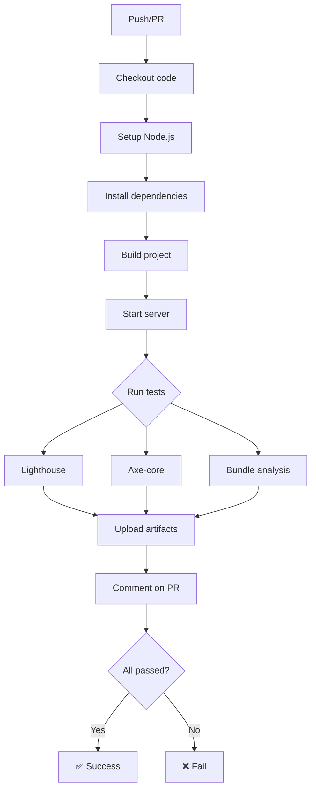

# Testing Guide - Safaia Publishing

Przewodnik po testowaniu wydajności, SEO i dostępności dla projektu Safaia Publishing.

---

## 📋 Spis treści

1. [Instalacja](#instalacja)
2. [Uruchamianie testów lokalnie](#uruchamianie-testów-lokalnie)
3. [Lighthouse Performance Tests](#lighthouse-performance-tests)
4. [Axe-core Accessibility Tests](#axe-core-accessibility-tests)
5. [GitHub Actions CI/CD](#github-actions-cicd)
6. [Interpretacja wyników](#interpretacja-wyników)
7. [Poprawianie błędów](#poprawianie-błędów)

---

## 🚀 Instalacja

### 1. Zainstaluj zależności

```bash
cd safaia-publishing
npm install
```

To zainstaluje wszystkie wymagane pakiety testowe:
- `lighthouse` - testy wydajności
- `@lhci/cli` - Lighthouse CI
- `@axe-core/puppeteer` - testy accessibility
- `puppeteer` - headless Chrome
- `chrome-launcher` - launcher dla Chrome

### 2. Zbuduj projekt

```bash
npm run build
```

---

## 🧪 Uruchamianie testów lokalnie

### Test Performance (Lighthouse)

```bash
# Uruchom serwer deweloperski
npm run dev

# W nowym terminalu
npm run test:lighthouse
```

**Co to testuje:**
- Performance score (cel: ≥90)
- Accessibility score (cel: ≥95)
- Best Practices score (cel: ≥90)
- SEO score (cel: ≥95)
- Core Web Vitals (LCP, CLS, TBT)

**Raporty zapisywane w:** `lighthouse-reports/`

---

### Test Accessibility (axe-core)

```bash
# Serwer musi być uruchomiony
npm run dev

# W nowym terminalu
npm run test:a11y
```

**Co to testuje:**
- WCAG 2.1 Level AA compliance
- ARIA attributes
- Color contrast
- Form labels
- Semantic HTML
- Keyboard navigation support

**Raporty zapisywane w:** `a11y-reports/`

---

### Wszystkie testy naraz

```bash
npm run test:performance
```

To uruchomi:
1. Lighthouse tests
2. Axe-core tests
3. Wygeneruje raporty HTML i JSON

---

## 🔍 Lighthouse Performance Tests

### Szczegółowe opcje

```bash
# Test z custom URL
TEST_URL=http://localhost:3000 npm run test:lighthouse

# Test tylko performance
node scripts/lighthouse.js --categories=performance

# Output jako JSON
node scripts/lighthouse.js --output=json

# Test produkcyjnej strony
TEST_URL=https://safaia.pl npm run test:lighthouse
```

### Struktura raportu

Lighthouse generuje następujące pliki w `lighthouse-reports/`:

```
lighthouse-reports/
├── homepage-desktop-2025-11-30.html        # Raport HTML
├── homepage-mobile-2025-11-30.html
├── katalog-desktop-2025-11-30.html
├── summary.json                             # Podsumowanie wszystkich testów
└── ...
```

### Kluczowe metryki

**Performance Budget:**
```json
{
  "performance": 90,
  "accessibility": 95,
  "best-practices": 90,
  "seo": 95
}
```

**Web Vitals Thresholds:**
```json
{
  "largest-contentful-paint": 2500,    // 2.5s
  "first-contentful-paint": 1800,      // 1.8s
  "cumulative-layout-shift": 0.1,
  "total-blocking-time": 200,          // 200ms
  "speed-index": 3400
}
```

### Przykładowy output

```
=============================================================================
📊 Homepage (Desktop)
=============================================================================

📈 Scores:
  🟢 performance         92/100
  🟢 accessibility       98/100
  🟢 bestPractices       95/100
  🟢 seo                 97/100

⚡ Core Web Vitals:
  FCP: 1523ms
  LCP: 2134ms ✅
  CLS: 0.045 ✅
  TBT: 187ms ✅
  SI: 2987ms

🔍 Diagnostics:
  Total Byte Weight: 487KB
  DOM Size: 342 elements
  Main Thread Work: 1234ms

✅ Wszystkie metryki w budżecie!
```

---

## 🛡️ Axe-core Accessibility Tests

### Szczegółowe opcje

```bash
# Test z WCAG AAA (zamiast AA)
node scripts/axe-test.js --wcag=AAA

# Test tylko jednej strony
TEST_URL=http://localhost:3000/katalog npm run test:a11y

# Test produkcji
TEST_URL=https://safaia.pl npm run test:a11y
```

### Struktura raportu

```
a11y-reports/
├── homepage-2025-11-30.json              # Szczegółowe wyniki JSON
├── katalog-2025-11-30.json
├── book-detail-2025-11-30.json
├── accessibility-report.html             # Raport HTML (easy to read)
└── violations.csv                        # CSV export
```

### Severity Levels

```
💥 CRITICAL  - Blokujące problemy, muszą być naprawione natychmiast
🔴 SERIOUS   - Poważne problemy, wysoki priorytet
🟡 MODERATE  - Średnie problemy, napraw w następnej iteracji
⚠️  MINOR    - Drobne problemy, nice to have
```

### Przykładowy output

```
=============================================================================
📄 Homepage
=============================================================================

📊 Summary:
  ✅ Passed: 47 rules
  ❌ Violations: 3 issues
  ⚠️  Incomplete: 2 issues (need manual review)

❌ Violations by Severity:
  🟡 MODERATE: 2
  ⚠️  MINOR: 1

📋 Detailed Violations:

⚠️  1. color-contrast
   Severity: MODERATE
   WCAG: wcag2aa, wcag143
   Description: Elements must have sufficient color contrast
   Help: https://dequeuniversity.com/rules/axe/4.10/color-contrast
   Affected elements: 2

   Element 1:
     HTML: <p class="text-gray-400">Placeholder text...</p>
     Target: .hero > p
     Fix: Element has insufficient color contrast of 3.2:1 (expected 4.5:1)

🔝 Top Issues to Fix:
  1. [moderate] color-contrast
     Affects 2 elements
     Fix: Ensure the contrast between foreground and background colors meets WCAG 2 AA contrast ratio thresholds
```

---

## 🤖 GitHub Actions CI/CD

### Workflow: Performance & Accessibility Audit

Automatyczne testy uruchamiają się:
- **Na każdym push do main/develop**
- **Na każdym Pull Request**
- **Codziennie o 2:00 AM UTC** (scheduled)
- **Manualnie** (workflow_dispatch)

### Struktura workflow

```yaml
jobs:
  1. lighthouse         # Testy performance
  2. accessibility      # Testy a11y
  3. bundle-analysis    # Analiza rozmiaru bundle
  4. deploy-preview     # Deploy preview (tylko PR)
  5. status-check       # Summary wszystkich testów
```

### Przebieg workflow



### Wymagane GitHub Secrets

Dodaj w **Settings → Secrets and variables → Actions**:

```bash
DEPLOY_URL          # URL deployed site (np. https://safaia.vercel.app)
VERCEL_TOKEN        # Token z Vercel (dla deploy preview)
VERCEL_ORG_ID       # Organization ID z Vercel
VERCEL_PROJECT_ID   # Project ID z Vercel
```

### PR Comments

Workflow automatycznie dodaje komentarz do PR z wynikami:

```markdown
## 🚀 Lighthouse Performance Report

### Summary
- **Total Tests:** 12
- **Passed:** 10 ✅
- **Failed:** 2 ❌

### Desktop Results

| Page | Performance | A11y | SEO | LCP | CLS |
|------|-------------|------|-----|-----|-----|
| ✅ Homepage | 94 | 98 | 97 | 1834ms | 0.045 |
| ❌ Katalog | 87 | 95 | 96 | 2789ms | 0.12 |
| ✅ Book Detail | 91 | 97 | 98 | 2234ms | 0.08 |

**Budget Thresholds:**
- Performance: ≥90
- Accessibility: ≥95
- SEO: ≥95
- LCP: ≤2500ms
- CLS: ≤0.1
```

---

## 📊 Interpretacja wyników

### Performance Score (Lighthouse)

**90-100 (Zielony)** ✅
- Świetna wydajność
- Strona ładuje się szybko
- Doskonałe UX

**50-89 (Pomarańczowy)** ⚠️
- Średnia wydajność
- Wymaga optymalizacji
- Możliwe spowolnienia na słabszych urządzeniach

**0-49 (Czerwony)** ❌
- Słaba wydajność
- Priorytet optymalizacji
- Zła UX, wysokie bounce rate

### Core Web Vitals

**LCP (Largest Contentful Paint)**
```
🟢 Good:      < 2.5s
🟡 Needs work: 2.5s - 4s
🔴 Poor:      > 4s
```
**Co to oznacza:** Czas załadowania największego elementu widocznego na ekranie.

**CLS (Cumulative Layout Shift)**
```
🟢 Good:      < 0.1
🟡 Needs work: 0.1 - 0.25
🔴 Poor:      > 0.25
```
**Co to oznacza:** Niestabilność layoutu - jak bardzo elementy "skaczą" podczas ładowania.

**FID/TBT**
```
🟢 Good FID:  < 100ms
🟢 Good TBT:  < 200ms
```
**Co to oznacza:** Responsywność - jak szybko strona reaguje na interakcje.

### Accessibility Score

**95-100** ✅ Doskonała dostępność
**90-94** ⚠️ Dobra, drobne poprawki
**< 90** ❌ Wymaga znaczących poprawek

**CRITICAL violations** = Automatyczny fail w CI

---

## 🔧 Poprawianie błędów

### Najczęstsze problemy i rozwiązania

#### 1. Low Performance Score

**Problem:** Zbyt duże obrazy
```tsx
// ❌ ZŁE


// ✅ DOBRE
import Image from 'next/image';

<Image
  src="/big-image.jpg"
  width={800}
  height={600}
  alt="Description"
  loading="lazy"
  quality={85}
/>
```

**Problem:** Brak lazy loading
```tsx
// Dla obrazków above-the-fold
<Image src="..." priority />

// Dla obrazków below-the-fold
<Image src="..." loading="lazy" />
```

**Problem:** Zbyt duży bundle JavaScript
```bash
# Analiza bundle
npm run analyze

# Użyj dynamic imports
const HeavyComponent = dynamic(() => import('./Heavy'), {
  loading: () => <Skeleton />,
});
```

---

#### 2. Accessibility Violations

**Problem:** Brak alt text
```tsx
// ❌ ZŁE


// ✅ DOBRE
<Image src="/book.jpg" alt="Okładka książki 'Tytuł' autorstwa Jan Kowalski" />

// Dla dekoracyjnych
<svg aria-hidden="true">...</svg>
```

**Problem:** Niski kontrast kolorów
```tsx
// ❌ ZŁE - kontrast 3.2:1
<p className="text-gray-400">Text</p>

// ✅ DOBRE - kontrast 7:1
<p className="text-gray-700">Text</p>
```

**Problem:** Brak labels w formularzu
```tsx
// ❌ ZŁE
<input type="text" placeholder="Name" />

// ✅ DOBRE
<label htmlFor="name">Name:</label>
<input type="text" id="name" placeholder="Name" />
```

**Problem:** Brak ARIA labels dla buttonów z ikonami
```tsx
// ❌ ZŁE
<button>
  <svg>...</svg>
</button>

// ✅ DOBRE
<button aria-label="Zamknij">
  <svg aria-hidden="true">...</svg>
</button>
```

---

#### 3. SEO Issues

**Problem:** Brak meta description
```tsx
// app/page.tsx
export const metadata = {
  title: 'Safaia - Wydawnictwo',
  description: 'Odkryj klejnoty literatury faktu o sztuce, modzie i fotografii.',
};
```

**Problem:** Brak strukturalnych danych
```tsx
// Dodaj JSON-LD
<script type="application/ld+json">
  {JSON.stringify({
    "@context": "https://schema.org",
    "@type": "Book",
    "name": book.title,
    "author": book.author.name,
    ...
  })}
</script>
```

---

## 📈 Continuous Monitoring

### Lokalne testy przed commit

```bash
# Pre-commit hook
npm run test:performance
```

### PR Review Checklist

Przed merge PR sprawdź:
- [ ] Lighthouse score ≥90 (performance)
- [ ] Lighthouse score ≥95 (accessibility, SEO)
- [ ] 0 critical accessibility issues
- [ ] LCP < 2.5s
- [ ] CLS < 0.1
- [ ] Bundle size w limitach

### Post-deploy Monitoring

Po wdrożeniu:
1. Uruchom testy na produkcji: `TEST_URL=https://safaia.pl npm run test:performance`
2. Sprawdź Google PageSpeed Insights: https://pagespeed.web.dev/
3. Zweryfikuj Search Console: https://search.google.com/search-console

---

## 🆘 Troubleshooting

### "Chrome not found" error

```bash
# macOS
brew install --cask google-chrome

# Linux
wget https://dl.google.com/linux/direct/google-chrome-stable_current_amd64.deb
sudo dpkg -i google-chrome-stable_current_amd64.deb
```

### "Port 3000 already in use"

```bash
# Kill process on port 3000
lsof -ti:3000 | xargs kill -9

# Lub użyj innego portu
PORT=3001 npm run dev
```

### Timeouts w CI

Zwiększ timeout w `.github/workflows/performance-audit.yml`:

```yaml
timeout-minutes: 30  # Zwiększ jeśli potrzeba
```

---

## 📚 Dodatkowe zasoby

- [Lighthouse Documentation](https://developer.chrome.com/docs/lighthouse/)
- [Axe-core Rules](https://github.com/dequelabs/axe-core/blob/develop/doc/rule-descriptions.md)
- [Web Vitals](https://web.dev/vitals/)
- [WCAG Guidelines](https://www.w3.org/WAI/WCAG21/quickref/)
- [Next.js Performance](https://nextjs.org/docs/advanced-features/measuring-performance)

---

## 📞 Support

Jeśli napotkasz problemy:
1. Sprawdź [SEO Checklist](./SEO-CHECKLIST.md)
2. Sprawdź [Accessibility Checklist](./ACCESSIBILITY-CHECKLIST.md)
3. Sprawdź [Performance Checklist](./PERFORMANCE-CHECKLIST.md)
4. Otwórz issue na GitHub
